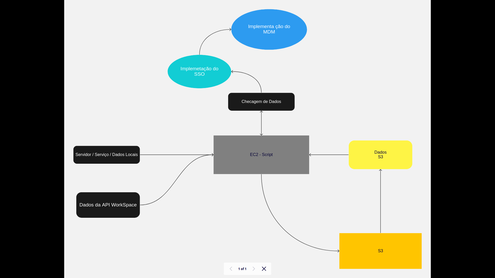

# Case - 3 

**Uma plataforma de gerenciamento de diretório em nuvem será implementada dentro da
empresa. Considerando as features de MDM (master device management), SSO e user lifecycle, qual
seria a ordem que você habilitaria primeiro e por quê? Como seria organizado o projeto de
implementação? E o gerenciamento?**
 

R- O Procedimento correto seria:

    1- Implementar um script em que faz a importação dos dados do antigo serviço.   
    1.1- Importação dos dados obtidos em um banco de dados em s3.
    1.2- Checa o versionamento dos dados.
    
    2- Implementação de regras para o S3 Incluindo o LifeCycle.  
    2.1-   Obter os dados armazenados e tratados em S3.
    2.1.2- Função no Script para obter e tratar as credenciais da API do Google WorkSpace. 
    2.1.3- Importar as credenciais.
    2.2-   Implementar o SSO.
    2.3-   Implementar o MDM com os dados tratados ate aqui.
    2.4-   Importar log do LifeCycle a cada X dias.

 
Para uma melhor compreensão eu fiz um fluxograma:

